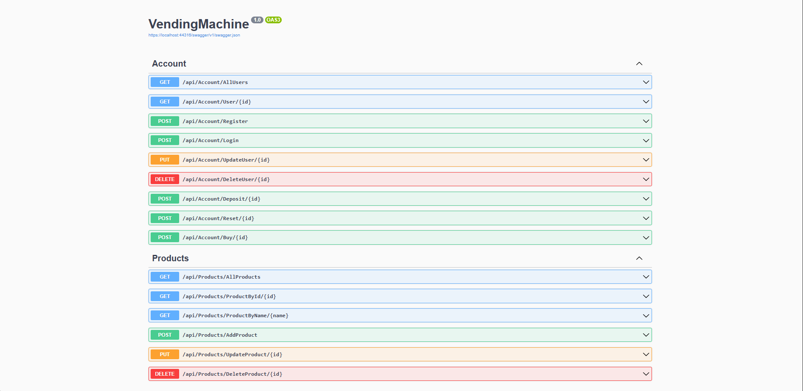

# Vending Machine API

This API provides functionalities for managing accounts and products within a vending machine system. The API supports operations like user registration, login, account management, product management, and purchase functionalities.

## Overview

The Vending Machine API allows you to:
- Manage user accounts, including registration, login, deposits, and purchases.
- Manage products, including adding, updating, and deleting products.
- Interact with the API to simulate the functionality of a vending machine.

## Endpoints

### Account Endpoints

| Method | Endpoint                       | Description                 |
|--------|--------------------------------|-----------------------------|
| GET    | `/api/Account/AllUsers`        | Get all users               |
| GET    | `/api/Account/User/{id}`       | Get a user by ID            |
| POST   | `/api/Account/Register`        | Register a new user         |
| POST   | `/api/Account/Login`           | Log in an existing user     |
| PUT    | `/api/Account/UpdateUser/{id}` | Update user details         |
| DELETE | `/api/Account/DeleteUser/{id}` | Delete a user               |
| POST   | `/api/Account/Deposit/{id}`    | Deposit funds               |
| POST   | `/api/Account/Reset/{id}`      | Reset account details       |
| POST   | `/api/Account/Buy/{id}`        | Buy a product               |

### Product Endpoints

| Method | Endpoint                              | Description                      |
|--------|---------------------------------------|----------------------------------|
| GET    | `/api/Products/AllProducts`           | Get all products                 |
| GET    | `/api/Products/ProductById/{id}`      | Get a product by ID              |
| GET    | `/api/Products/ProductByName/{name}`  | Get a product by name            |
| POST   | `/api/Products/AddProduct`            | Add a new product                |
| PUT    | `/api/Products/UpdateProduct/{id}`    | Update product details           |
| DELETE | `/api/Products/DeleteProduct/{id}`    | Delete a product                 |

## Image
 
